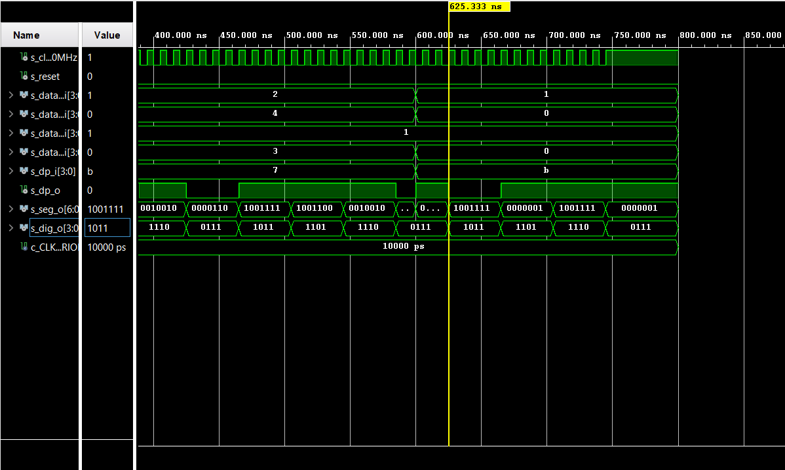

# Lab 6: Driver for multiple seven-segment displays

## Preparation tasks


<details><summary>Code for later use</summary>
<p>

Created in [WaveDrom](https://wavedrom.com/).

```javascript
{
  signal:
  [
    ['Digit position',
      {name: 'Common anode: AN(3)', wave: 'xx01..01..01'},
      {name: 'AN(2)', wave: 'xx101..01..0'},
      {name: 'AN(1)', wave: 'xx1.01..01..'},
      {name: 'AN(0)', wave: 'xx1..01..01.'},
    ],
    ['Seven-segment data',
      {name: '4-digit value to display', wave: 'xx3333555599', data: ['3','1','4','2','3','1','4','2','3','1']},
      {name: 'Cathod A: CA', wave: 'xx01.0.1.0.1'},
      {name: 'CB', wave: 'xx0.........'},
      {name: 'CC', wave: 'xx0..10..10.'},
      {name: 'CD', wave: 'xx01.0.1.0.1'},
      {name: 'CE', wave: 'xx1..01..01.'},
      {name: 'CF', wave: 'xx1.01..01..'},
      {name: 'CG', wave: 'xx010..10..1'},
    ],
    {name: 'Decimal point: DP', wave: 'xx01..01..01'},
  ],
  head:
  {
    text: '                    4ms   4ms   4ms   4ms   4ms   4ms   4ms   4ms   4ms   4ms',
  },
}
```

</p>
</details>

## Display driver

### Listing of VHDL code of the process `p_mux`
```VHDL
    p_mux : process(s_cnt, data0_i, data1_i, data2_i, data3_i, dp_i)
    begin
        case s_cnt is
            when "11" =>
                s_hex <= data3_i;
                dp_o  <= dp_i(3);
                dig_o <= "0111";

            when "10" =>
                s_hex <= data2_i;
                dp_o  <= dp_i(2);
                dig_o <= "1011";

            when "01" =>
                s_hex <= data1_i;
                dp_o  <= dp_i(1);
                dig_o <= "1101";

            when others =>
                s_hex <= data0_i;
                dp_o  <= dp_i(0);
                dig_o <= "1110";
        end case;
    end process p_mux;
```

### Listing of VHDL testbench file `tb_driver_7seg_4digits`
```VHDL
library ieee;
use ieee.std_logic_1164.all;

------------------------------------------------------------------------
-- Entity declaration for testbench
------------------------------------------------------------------------
entity tb_driver_7seg_4digits is
    -- Entity of testbench is always empty
end entity tb_driver_7seg_4digits;

------------------------------------------------------------------------
-- Architecture body for testbench
------------------------------------------------------------------------
architecture testbench of tb_driver_7seg_4digits is

    -- Local constants
    constant c_CLK_100MHZ_PERIOD : time := 10 ns;

    --Local signals
    signal s_clk_100MHz : std_logic;
    signal s_reset      : std_logic;
    
    signal s_data0_i    : std_logic_vector(4 - 1 downto 0);
    signal s_data1_i    : std_logic_vector(4 - 1 downto 0);
    signal s_data2_i    : std_logic_vector(4 - 1 downto 0);
    signal s_data3_i    : std_logic_vector(4 - 1 downto 0);
    signal s_dp_i       : std_logic_vector(4 - 1 downto 0);
    
    signal s_dp_o       : std_logic;
    signal s_seg_o      : std_logic_vector(7 - 1 downto 0);
    signal s_dig_o      : std_logic_vector(4 - 1 downto 0);

begin
    -- Connecting testbench signals with driver_7seg_4digits entity
    -- (Unit Under Test)
    uut_driver_7seg : entity work.driver_7seg_4digits
        port map(
            clk      => s_clk_100MHz,
            reset    => s_reset,
            data0_i  => s_data0_i,
            data1_i  => s_data1_i,
            data2_i  => s_data2_i,
            data3_i  => s_data3_i,
            dp_i     => s_dp_i,
            dp_o     => s_dp_o, 
            seg_o    => s_seg_o,
            dig_o    => s_dig_o
        );

    --------------------------------------------------------------------
    -- Clock generation process
    --------------------------------------------------------------------
    p_clk_gen : process
    begin
        while now < 750 ns loop         -- 75 periods of 100MHz clock
            s_clk_100MHz <= '0';
            wait for c_CLK_100MHZ_PERIOD / 2;
            s_clk_100MHz <= '1';
            wait for c_CLK_100MHZ_PERIOD / 2;
        end loop;
        wait;
    end process p_clk_gen;

    --------------------------------------------------------------------
    -- Reset generation process
    --------------------------------------------------------------------
    p_reset_gen: process
    begin
        s_reset <= '0';
        wait for 10 ns;
        
        s_reset <= '1';
        wait for 53 ns;
        
        s_reset <= '0';
        wait;
    end process p_reset_gen;

    --------------------------------------------------------------------
    -- Data generation process
    --------------------------------------------------------------------
   p_stimulus: process
    begin
        report "Stimulus process started" severity note;

        s_data3_i <= "0011";
        s_data2_i <= "0001";
        s_data1_i <= "0100";
        s_data0_i <= "0010";
        s_dp_i    <= "0111";
        
        wait for 600 ns;
        
        s_data3_i <= "0000";
        s_data2_i <= "0001";
        s_data1_i <= "0000";
        s_data0_i <= "0001";
        s_dp_i    <= "1011";
        
        report "Stimulus process finished" severity note;
        wait;
        
    end process p_stimulus;

end architecture testbench;
```

### Screenshot with simulated time waveforms



### Listing of VHDL architecture of the `top`
```VHDL
library IEEE;
use IEEE.STD_LOGIC_1164.ALL;

-- Uncomment the following library declaration if using
-- arithmetic functions with Signed or Unsigned values
--use IEEE.NUMERIC_STD.ALL;

-- Uncomment the following library declaration if instantiating
-- any Xilinx leaf cells in this code.
--library UNISIM;
--use UNISIM.VComponents.all;

entity top is
    Port( 
           CLK100MHZ : in STD_LOGIC;
           BTNC      : in STD_LOGIC;
           SW        : in STD_LOGIC_VECTOR(16 - 1 downto 0);
           CA        : out STD_LOGIC;
           CB        : out STD_LOGIC;
           CC        : out STD_LOGIC;
           CD        : out STD_LOGIC;
           CE        : out STD_LOGIC;
           CF        : out STD_LOGIC;
           CG        : out STD_LOGIC;
           DP        : out STD_LOGIC;
           AN        : out STD_LOGIC_VECTOR(8 - 1 downto 0)
    );
end top;

architecture Behavioral of top is

begin
    driver_7seg_4 : entity work.driver_7seg_4digits
        port map(
            clk         => CLK100MHZ,
            reset       => BTNC,
            --------------------
            data0_i(3)  => SW(3),
            data0_i(2)  => SW(2),
            data0_i(1)  => SW(1),
            data0_i(0)  => SW(0),
            --------------------              
            data1_i(7)  => SW(7),
            data1_i(6)  => SW(6),
            data1_i(5)  => SW(5),
            data1_i(4)  => SW(4),
            --------------------
            data2_i(11) => SW(11),
            data2_i(10) => SW(10),
            data2_i(9)  => SW(9),
            data2_i(8)  => SW(8),
            --------------------
            data3_i(15) => SW(15),
            data3_i(14) => SW(14),
            data3_i(13) => SW(13),
            data3_i(12) => SW(12),
            --------------------
            dp_i        => "0111",
            --------------------
            seg_o(6)    => CG,
            seg_o(5)    => CF,
            seg_o(4)    => CE,
            seg_o(3)    => CD,
            seg_o(2)    => CC,
            seg_o(1)    => CB,
            seg_o(0)    => CA,
            
            dig_o       => AN(4 - 1 downto 0),
            dp_o        => DP
        );
    
    -- Disconnect top 4 digits
    AN(8 - 1 downto 4)  <= b"1111";
    
end Behavioral;
```

## 8-digit driver

