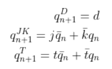
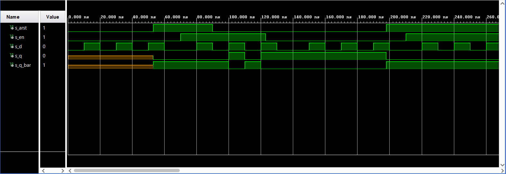
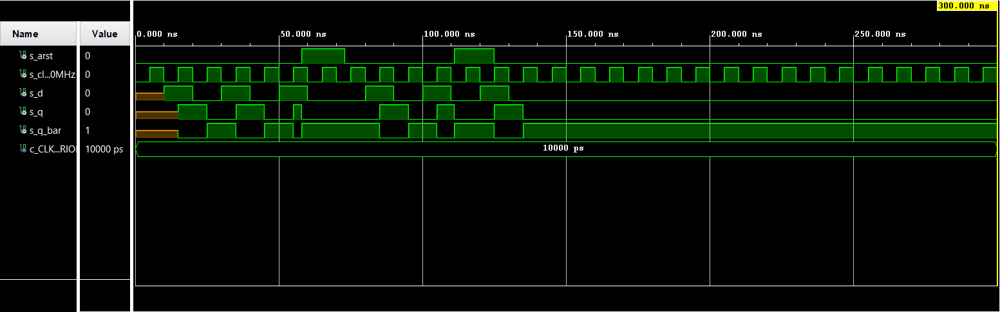
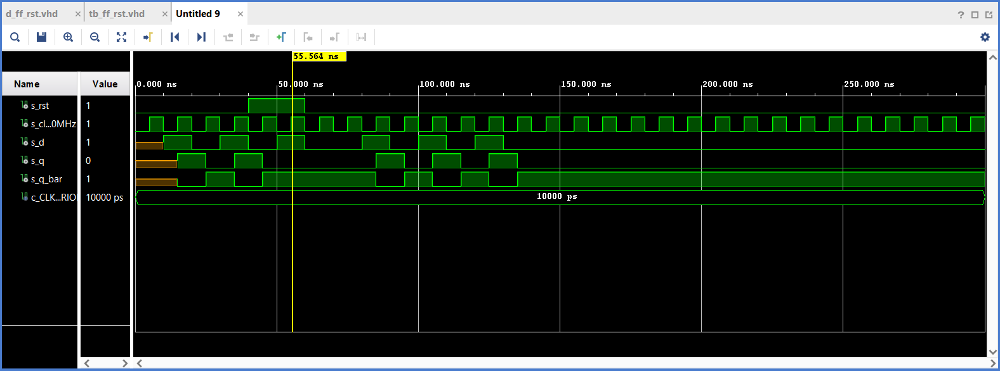
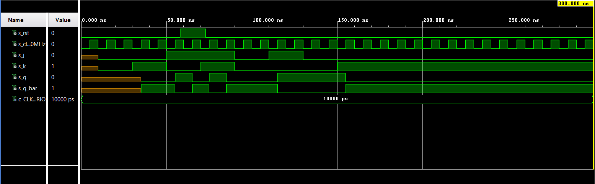
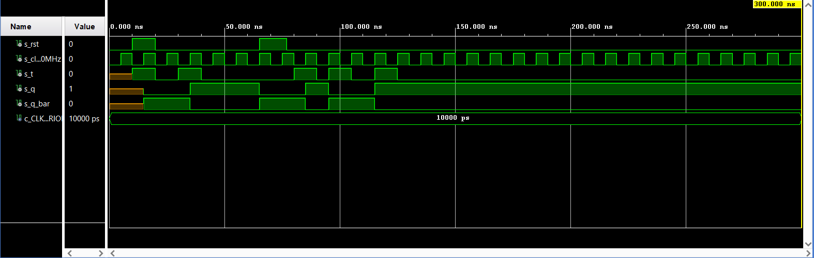
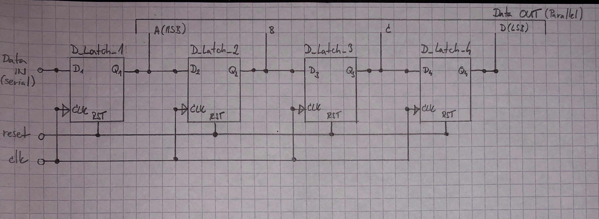

# Lab 7: Latches and Flip-flops

## 1. Preparation tasks

   | **D** | **Qn** | **Q(n+1)** | **Comments** |
   | :-: | :-: | :-: | :-- |
   | 0 | 0 | q | No change |
   | 0 | 1 | 0 | Reset |
   | 1 | 0 | q | No change |
   | 1 | 1 | 1 | Set |

   | **J** | **K** | **Qn** | **Q(n+1)** | **Comments** |
   | :-: | :-: | :-: | :-: | :-- |
   | 0 | 0 | 0 | 0 | No change |
   | 0 | 0 | 1 | 1 | No change |
   | 0 | 1 | 0 | 0 | Reset |
   | 0 | 1 | 1 | 0 | Reset |
   | 1 | 0 | 0 | 1 | Set |
   | 1 | 0 | 1 | 1 | Set |
   | 1 | 1 | 0 | 1 | Toggle |
   | 1 | 1 | 1 | 0 | Toggle |

   | **T** | **Qn** | **Q(n+1)** | **Comments** |
   | :-: | :-: | :-: | :-- |
   | 0 | 0 | 0 | No Change |
   | 0 | 1 | 1 | No Change |
   | 1 | 0 | 1 | Invert (Toggle) |
   | 1 | 1 | 0 | Invert (Toggle) |



## 2. D Latch

### VHDL code listing of the process `p_d_latch`
```VHDL
    p_d_latch : process (d, arst, en)
    begin
        if (arst = '1') then
            q     <= '0';
            q_bar <= '1';
        elsif (en = '1') then
            q     <= d;
            q_bar <= not d;
        end if;
    end process p_d_latch;
```

### Listing of VHDL reset and stimulus processes from the testbench
```VHDL
    p_reset_gen: process
    begin
        s_arst <= '0';
        wait for 53 ns;
        
        s_arst <= '1';
        wait for 5 ns;
        
        s_arst <= '0';
        
        wait for 108 ns;
        
        s_arst <= '1';
        wait;
    end process p_reset_gen;
```

```VHDL
   p_stimulus: process
    begin
        report "Stimulus process started" severity note;
        s_en <= '0';
        s_d <= '0';
        
        --d sequence
        wait for 10 ns;
        s_d <= '1';
        wait for 10 ns;
        s_d <= '0';
        wait for 10 ns;
        s_d <= '1';
        wait for 10 ns;
        s_d <= '0';
        wait for 10 ns;
        s_d <= '1';
        wait for 10 ns;
        s_d <= '0';
        wait for 10 ns;
        --/d sequence
        
        s_en <= '1';
        
        wait for 3 ns;
        assert(s_q = '0' and s_q_bar = '1')
        report "There was an error while asserting s_q = '0' and s_q_bar = '1'" severity error;
        
        --d sequence
        wait for 7 ns;
        s_d <= '1';
        wait for 10 ns;
        s_d <= '0';
        wait for 10 ns;
        s_d <= '1';
        wait for 10 ns;
        s_d <= '0';
        wait for 10 ns;
        s_d <= '1';
        wait for 3 ns;
        s_en <= '0';
        wait for 7 ns;
        s_d <= '0';
        wait for 10 ns;
        --/d sequence
        
        wait for 3 ns;
        assert(s_q = '1' and s_q_bar = '0')
        report "There was an error while asserting s_q = '1' and s_q_bar = '0'" severity error;
        
        --d sequence
        wait for 7 ns;
        s_d <= '1';
        wait for 10 ns;
        s_d <= '0';
        wait for 10 ns;
        s_d <= '1';
        wait for 10 ns;
        s_d <= '0';
        wait for 10 ns;
        s_d <= '1';
        wait for 10 ns;
        s_d <= '0';
        wait for 7 ns;
        --/d sequence
        
        assert(s_q = '0' and s_q_bar = '1')
        report "There was an error while asserting s_q = '0' and s_q_bar = '1'" severity error;
        wait for 3 ns;
        
        s_en <= '1';
        
        --d sequence
        wait for 10 ns;
        s_d <= '1';
        wait for 10 ns;
        s_d <= '0';
        wait for 10 ns;
        s_d <= '1';
        wait for 10 ns;
        s_d <= '0';
        wait for 10 ns;
        s_d <= '1';
        wait for 10 ns;
        s_d <= '0';
        wait for 10 ns;
        --/d sequence
        
        report "Stimulus process finished" severity note;
        wait;
        
    end process p_stimulus;
```

### Screenshot with simulated time waveforms



## 3. Flip-flops

### VHDL code listing of the process `p_d_ff_arst` and clock + reset + stimulus processes

```VHDL
    p_d_ff_arst : process (clk, arst)
    begin
        if (arst = '1') then
            q     <= '0';
            q_bar <= '1';
        elsif rising_edge(clk) then
            q     <= d;
            q_bar <= not d;
        end if;
    end process p_d_ff_arst;
```

```VHDL
    --------------------------------------------------------------------
    -- Clock generation process
    --------------------------------------------------------------------
    p_clk_gen : process
    begin
        while now < 750 ns loop
            s_clk_100MHZ <= '0';
            wait for c_CLK_100MHZ_PERIOD / 2;
            s_clk_100MHZ <= '1';
            wait for c_CLK_100MHZ_PERIOD / 2;
        end loop;
        wait;
    end process p_clk_gen;
    
    --------------------------------------------------------------------
    -- Reset generation process
    --------------------------------------------------------------------
    p_reset_gen: process
    begin
        s_arst <= '0';
        wait for 58 ns;
        
        s_arst <= '1';
        wait for 15 ns;
        
        s_arst <= '0';
        wait;
    end process p_reset_gen;
 
    --------------------------------------------------------------------
    -- Data generation process
    --------------------------------------------------------------------
    p_stimulus: process
    begin
        report "Stimulus process started" severity note;
        
        --d sequence
        wait for 10 ns;
        s_d <= '1';
        --/d sequence
        
        --check when d = '1' on rising edge
        wait for 7 ns;
        assert(s_q = '1' and s_q_bar = '0')
        report "There was an error while asserting s_q = '1' and s_q_bar = '0'" severity error;
        
        --d sequence
        wait for 3 ns;
        s_d <= '0';
        wait for 10 ns;
        s_d <= '1';
        wait for 10 ns;
        s_d <= '0';
        wait for 10 ns;
        s_d <= '1';
        wait for 10 ns;
        s_d <= '0';
        wait for 3 ns;
        --/d sequence
        
        --check when d = '0' on rising edge
        wait for 7 ns;
        assert(s_q = '0' and s_q_bar = '1')
        report "There was an error while asserting s_q = '0' and s_q_bar = '1'" severity error;
        
        --d sequence
        wait for 10 ns;
        s_d <= '1';
        wait for 10 ns;
        s_d <= '0';
        wait for 10 ns;
        s_d <= '1';
        wait for 10 ns;
        s_d <= '0';
        --/d sequence
        
        --check when rst = '1' on rising edge
        wait for 3 ns;
        assert(s_q = '0' and s_q_bar = '1')
        report "There was an error while asserting s_q = '0' and s_q_bar = '1'" severity error;        
        
        --d sequence
        wait for 7 ns;
        s_d <= '1';
        wait for 10 ns;
        s_d <= '0';
        wait for 10 ns;
        --/d sequence
        
        report "Stimulus process finished" severity note;
        wait;
        
    end process p_stimulus;
```

### Screenshot with simulated time waveforms of the process `p_d_ff_arst`



### VHDL code listing of the process `p_d_ff_rst` and clock + reset + stimulus processes

```VHDL
    p_d_ff_rst : process (clk)
    begin
        if rising_edge(clk) then
            if (rst = '1') then
                q     <= '0';
                q_bar <= '1';
            else
                q     <= d;
                q_bar <= not d;
            end if;
        end if;
    end process p_d_ff_rst;
```

```VHDL
    --------------------------------------------------------------------
    -- Clock generation process
    --------------------------------------------------------------------
    p_clk_gen : process
    begin
        while now < 750 ns loop
            s_clk_100MHZ <= '0';
            wait for c_CLK_100MHZ_PERIOD / 2;
            s_clk_100MHZ <= '1';
            wait for c_CLK_100MHZ_PERIOD / 2;
        end loop;
        wait;
    end process p_clk_gen;
    
    --------------------------------------------------------------------
    -- Reset generation process
    --------------------------------------------------------------------
    p_reset_gen: process
    begin
        s_rst <= '0';
        wait for 40 ns;
        
        s_rst <= '1';
        wait for 20 ns;
        
        s_rst <= '0';
        wait;
    end process p_reset_gen;

    --------------------------------------------------------------------
    -- Data generation process
    --------------------------------------------------------------------
    p_stimulus: process
    begin
        report "Stimulus process started" severity note;
        
        --d sequence
        wait for 10 ns;
        s_d <= '1';
        wait for 10 ns;
        s_d <= '0';
        wait for 10 ns;
        s_d <= '1';
        wait for 10 ns;
        s_d <= '0';
        wait for 10 ns;
        s_d <= '1';
        --d sequence
        
        -- check reset on rising edge;
        wait for 5 ns;
        assert(s_q = '0' and s_q_bar = '1')
        report "There was an error while asserting s_q = '0' and s_q_bar = '1'" severity error;
        
        --d sequence
        wait for 5 ns;
        s_d <= '0';
        wait for 10 ns;
        --/d sequence
        
        -- check when d = '0' on rising edge;
        wait for 5 ns;
        assert(s_q = '0' and s_q_bar = '1')
        report "There was an error while asserting s_q = '0' and s_q_bar = '1'" severity error;
        
         --d sequence
        wait for 5 ns;
        s_d <= '1';
        wait for 10 ns;
        s_d <= '0';
        wait for 10 ns;
        s_d <= '1';
        wait for 10 ns;
        s_d <= '0';
        wait for 10 ns;
        s_d <= '1';
        --/d sequence
        
        -- check when d = '1' on rising edge;
        wait for 7 ns;
        assert(s_q = '1' and s_q_bar = '0')
        report "There was an error while asserting s_q = '1' and s_q_bar = '0'" severity error;
        
        --/d sequence
        wait for 3 ns;
        s_d <= '0';
        wait for 10 ns;
        --/d sequence
        
        report "Stimulus process finished" severity note;
        wait;
        
    end process p_stimulus;
```

### Screenshot with simulated time waveforms of the process `p_d_ff_rst`



### VHDL code listing of the process `p_jk_ff_rst` and clock + reset + stimulus processes

```VHDL
    p_jk_ff_rst : process (clk)
    begin
        if rising_edge(clk) then
            if (rst = '1') then
                s_q <= '0';
            else
                if (j = '0' and k = '0') then
                    s_q <= s_q;
                elsif (j = '0' and k = '1') then
                    s_q <= '0';
                elsif (j = '1' and k = '0') then
                    s_q <= '1';
                elsif (j = '1' and k = '1') then
                    s_q <= not s_q;
                end if;
            end if;  
        end if;
    end process p_jk_ff_rst;
```

```VHDL
    --------------------------------------------------------------------
    -- Clock generation process
    --------------------------------------------------------------------
    p_clk_gen : process
    begin
        while now < 750 ns loop
            s_clk_100MHZ <= '0';
            wait for c_CLK_100MHZ_PERIOD / 2;
            s_clk_100MHZ <= '1';
            wait for c_CLK_100MHZ_PERIOD / 2;
        end loop;
        wait;
    end process p_clk_gen;

    --------------------------------------------------------------------
    -- Reset generation process
    --------------------------------------------------------------------
    p_reset_gen: process
    begin
        s_rst <= '0';
        wait for 58 ns;
        
        s_rst <= '1';
        wait for 15 ns;
        
        s_rst <= '0';
        wait;
    end process p_reset_gen;

    --------------------------------------------------------------------
    -- Data generation process
    --------------------------------------------------------------------
    p_stimulus: process
    begin
        report "Stimulus process started" severity note;
        
        --jk sequence
        wait for 10 ns;
        s_j <= '0';
        s_k <= '0';
        wait for 20 ns;
        s_j <= '0';
        s_k <= '1';
        wait for 20 ns;
        s_j <= '1';
        s_k <= '0';
        wait for 20 ns;
        s_j <= '1';
        s_k <= '1';
        --/jk sequence
        
        --check for Toggle
        wait for 7 ns;
        assert(s_q = '1' and s_q_bar = '0')
        report "There was an error while asserting s_q = '1' and s_q_bar = '0'" severity error;
        
        --jk sequence
        wait for 13 ns;
        s_j <= '0';
        s_k <= '0';
        wait for 20 ns;
        s_j <= '1';
        s_k <= '0';
        --/jk sequence
        
        --check for Set
        wait for 7 ns;
        assert(s_q = '1' and s_q_bar = '0')
        report "There was an error while asserting s_q = '1' and s_q_bar = '0'" severity error;
        
        --jk sequence
        wait for 13 ns;
        s_j <= '0';
        s_k <= '0';
        --/jk sequence
        
        
        --check for No change
        wait for 7 ns;
        assert(s_q = '1' and s_q_bar = '0')
        report "There was an error while asserting s_q = '1' and s_q_bar = '0'" severity error;
        
        --jk sequence
        wait for 13 ns;
        s_j <= '0';
        s_k <= '1';
        wait for 7 ns;
        --/jk sequence
        
        --check for Reset
        assert(s_q = '0' and s_q_bar = '1')
        report "There was an error while asserting s_q = '0' and s_q_bar = '1'" severity error;       
        wait for 13 ns;
        
        report "Stimulus process finished" severity note;
        wait;
        
    end process p_stimulus;
```

### Screenshot with simulated time waveforms of the process `p_jk_ff_rst`



### VHDL code listing of the process `p_t_ff_rst` and clock + reset + stimulus processes

```VHDL
    p_t_ff_rst : process (clk)
    begin
        if rising_edge(clk) then
            if (rst = '1') then
                s_q <= '0';
            else
                if (t = '0') then
                    s_q <= s_q;
                elsif (t = '1') then
                    s_q <= not s_q;
                end if;
            end if;  
        end if;
    end process p_t_ff_rst;
    
    q <= s_q;
    q_bar <= not s_q;
```

```VHDL
    --------------------------------------------------------------------
    -- Clock generation process
    --------------------------------------------------------------------
    p_clk_gen : process
    begin
        while now < 750 ns loop
            s_clk_100MHZ <= '0';
            wait for c_CLK_100MHZ_PERIOD / 2;
            s_clk_100MHZ <= '1';
            wait for c_CLK_100MHZ_PERIOD / 2;
        end loop;
        wait;
    end process p_clk_gen;

    --------------------------------------------------------------------
    -- Reset generation process
    --------------------------------------------------------------------
    p_reset_gen: process
    begin
        s_rst <= '0';
        wait for 10 ns;
        
        s_rst <= '1';
        wait for 10 ns;
        
        s_rst <= '0';
        wait for 45 ns;

        s_rst <= '1';
        wait for 12 ns;
        
        s_rst <= '0';
        wait;
    end process p_reset_gen;

    --------------------------------------------------------------------
    -- Data generation process
    --------------------------------------------------------------------
    p_stimulus: process
    begin
        report "Stimulus process started" severity note;
     
        --t sequence
        wait for 10 ns;
        s_t <= '1';
        wait for 10 ns;
        s_t <= '0';
        wait for 10 ns;
        s_t <= '1';
        wait for 10 ns;
        s_t <= '0';
        wait for 10 ns;
        --/t sequence
        
        --check for No change
        assert(s_q = '1' and s_q_bar = '0')
        report "There was an error while asserting s_q = '1' and s_q_bar = '0'" severity error;       
        
        --t sequence
        wait for 30 ns;
        s_t <= '1';
        wait for 10 ns;
        s_t <= '0';
        wait for 5 ns; --shorter time gap
        s_t <= '1';
        --/t sequence
        
        --check for toggle
        wait for 7 ns;
        assert(s_q = '0' and s_q_bar = '1')
        report "There was an error while asserting s_q = '0' and s_q_bar = '1'" severity error;
        
        
        --t sequence
        wait for 3 ns;
        s_t <= '0';
        wait for 10 ns;
        s_t <= '1';
        wait for 10 ns;
        s_t <= '0';
        wait for 10 ns;
        --/t sequence
        
        report "Stimulus process finished" severity note;
        wait;
        
    end process p_stimulus;
```

### Screenshot with simulated time waveforms of the process `p_t_ff_rst`



## 4. Shift register

### Screenshot

